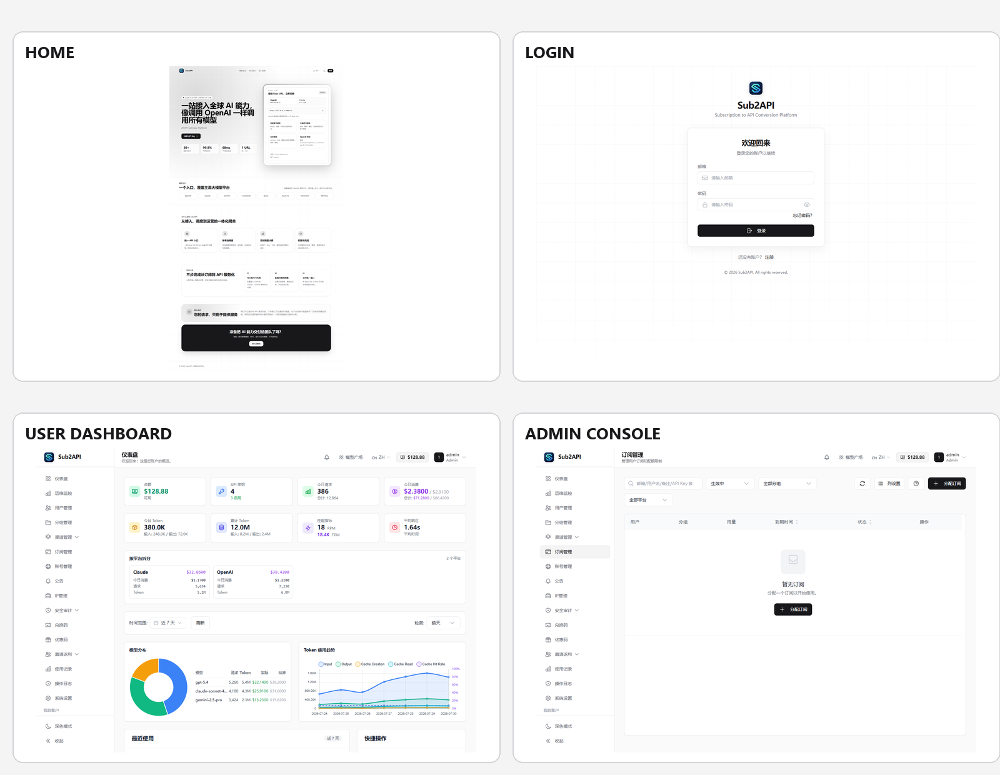

<div align="center">

# Sub2Aouter Apophis Theme

**基于 Sub2API 的可持续更新定制前端发行版**

Apophis 风格首页、认证页面、用户控制台和管理后台，保留 Sub2API 原有后端、数据库、接口、鉴权和业务功能。

[](https://github.com/Wei-Shaw/sub2api)
[](https://github.com/kibght/sub2aouter/pkgs/container/sub2aouter)
[](THEME.md)

</div>



## 项目定位

本仓库不是重新实现 Sub2API，也不修改其业务协议，而是在官方上游源码之上维护一层可重复应用的前端主题：

```text
Wei-Shaw/sub2api 上游源码
            │
            ▼
应用 theme/apophis 覆盖层
            │
            ▼
前端/后端测试 + Docker 构建
            │
      ┌─────┴─────┐
      ▼           ▼
themed-release   GHCR 镜像
```

- `main`：永久主题、覆盖脚本、工作流和发布配置。
- `themed-release`：根据最新上游自动生成的可部署源码。
- `ghcr.io/kibght/sub2aouter:latest`：测试通过后发布的最新主题镜像。
- `ghcr.io/kibght/sub2aouter:upstream-<commit>`：可回滚的上游固定版本镜像。

## 前端修改内容

### 公开首页

- 黑白网格背景和浮动导航。
- Hero 双栏布局与 Base URL 切换面板。
- OpenAI / Claude 地址切换和一键复制。
- 模型生态、核心能力、接入流程、隐私承诺和 CTA。
- 桌面端、移动端和深色模式适配。

### 认证页面

- 登录、注册、找回密码统一为 Apophis 黑白视觉。
- 黑色主按钮、细边框输入框、网格背景和中性卡片。
- 保留原有邮箱、密码、OAuth、Turnstile、协议确认和 2FA 逻辑。

### 用户与管理控制台

- 统一侧边栏、顶部栏、卡片、表格、筛选框、下拉菜单和按钮。
- 去除原版青绿色渐变背景和高饱和激活态。
- 使用中性灰导航激活态、黑色主操作按钮和数字用户标识。
- 用户端和管理员端继续使用原有路由、权限和接口。

## 动态站点品牌

主题不会写死目标站名称、域名或 Logo。以下内容继续读取 **系统设置**：

- 站点名称 `site_name`
- 站点 Logo `site_logo`
- 站点副标题 `site_subtitle`
- API Base URL `api_base_url`
- 联系方式 `contact_info`
- 文档地址 `doc_url`

修改管理后台中的系统设置后，首页导航、首页页脚、登录/注册页、侧边栏、页面标题和 Logo 会跟随配置更新。页脚年份自动使用当前年份。

## 保持不变的功能

主题覆盖层不修改：

- Go 后端实现
- 数据库 Schema 和 Migration
- Redis 与 PostgreSQL 数据结构
- API 路径和请求/响应协议
- JWT、Refresh Token、OAuth、2FA 和权限判断
- 用户、分组、渠道、订阅、支付、兑换和审计业务逻辑
- Go Embed 前端嵌入方式

仓库中的非样式辅助改动仅用于：上游同步、测试、Docker/Compose、Windows 本地启动和镜像发布。

## 自动跟随上游

`.github/workflows/upstream-theme-sync.yml` 会：

1. 由 `.github/workflows/infinite-canvas-upstream-sync.yml` 每小时统一协调；上游 Release、仓库提交和 Canvas SHA 均未变化且二进制 Release 完整时直接结束。
2. 拉取 `Wei-Shaw/sub2api` 最新上游源码。
3. 复制永久主题和工具文件。
4. 应用 `theme/apophis/manifest.json`。
5. 检查 UTF-8、乱码、主题漂移和边界约束。
6. 运行前端 lint、typecheck、回归测试和生产构建。
7. 运行后端单元测试。
8. 构建并推送不可变 GHCR 镜像。
9. 更新 `themed-release`。
10. 最后更新 `latest` 镜像。
11. Docker 镜像和二进制 Release 使用同一个 `0.1.x` 递增版本号。
12. 管理后台版本卡片加载时使用缓存检查 `kibght/sub2aouter`，手动刷新时强制查询最新 Release。
13. Docker 构建只显示 Compose 更新命令，不在容器内部替换二进制。
14. 同步时继承当前源码已包含的上游 Release 标题、链接和完整更新日志。
15. 找不到匹配的上游 Release 时，自动回退为上游提交摘要。
16. `themed-release` 作为无父快照推送，避免携带上游 Git 历史导致远端解包失败。


任何检查失败时，不更新 `themed-release` 和 `latest`，现有部署继续使用上一个通过验证的版本。

## Docker 部署

### 直接拉取镜像

```bash
docker pull ghcr.io/kibght/sub2aouter:latest
```

### 完整 Compose 部署

```bash
git clone --branch themed-release --single-branch \
  https://github.com/kibght/sub2aouter.git

cd sub2aouter/deploy
cp .env.example .env
```

编辑 `.env`，至少设置数据库密码、Redis 密码、管理员账号、JWT 密钥和 TOTP 加密密钥，然后启动：

```bash
docker compose pull
docker compose up -d
docker compose ps
```

验证：

```bash
curl -fsS http://127.0.0.1:8080/health
docker compose logs --tail=200 sub2api
```

## 日常更新

服务器无需重新编译前端：

```bash
cd sub2aouter/deploy
docker compose pull sub2api
docker compose up -d --no-deps sub2api
```

数据库、Redis 和应用数据保存在 Docker Volume 中，更新镜像不会删除数据。

## Windows 本地查看

完整 Windows 运行环境位于：

```text
tools/windows-local
```

安装 Docker Desktop 后双击：

```text
tools/windows-local/start-local.cmd
```

默认访问：

```text
http://127.0.0.1:18080/home
```

## 本地开发验证

项目固定使用 pnpm `9.15.9`：

```powershell
cd frontend
corepack pnpm install --frozen-lockfile
corepack pnpm run lint:check
corepack pnpm run typecheck
corepack pnpm run test:run
corepack pnpm run build
```

主题与编码检查：

```powershell
node scripts/apply-theme.mjs --root . --check
node scripts/check-encoding.mjs
node --test scripts/__tests__/*.test.mjs
```

## 回滚

查询已发布的不可变镜像标签，然后将 Compose 中的镜像切换为：

```text
ghcr.io/kibght/sub2aouter:upstream-<commit>
```

重新拉取并启动即可回滚，不需要回滚数据库。

## 上游项目

本项目基于 [Wei-Shaw/sub2api](https://github.com/Wei-Shaw/sub2api) 持续生成，后端能力、协议和许可证以对应上游版本为准。本仓库维护的是前端主题、发布链路和部署体验。
